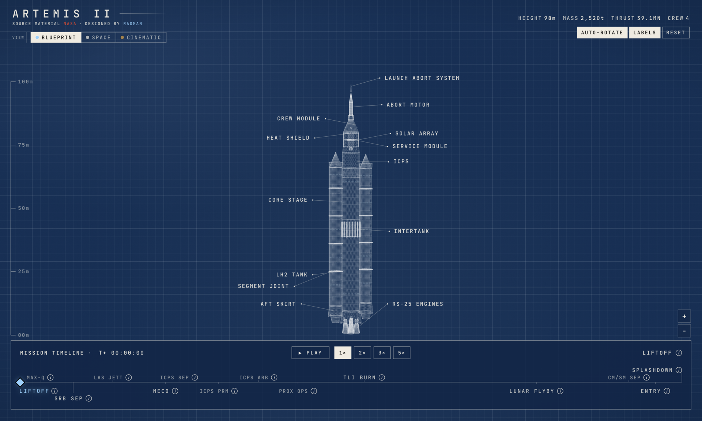
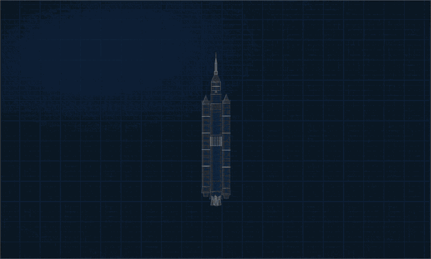

# Artemis II

An interactive 3D wireframe of NASA's Artemis II, the first crewed mission to cislunar space since Apollo.



**Live at [artemis.radman.dev](https://artemis.radman.dev)**

## What it does

Scrub the mission clock from liftoff to splashdown and watch stage separations, engine plumes, entry plasma and parachute deployment play out in real time. Click any component of the SLS or Orion stack for a NASA-sourced dossier.



## Features

- Timeline with 14 mission phases from liftoff to splashdown
- 14 clickable vehicle components, each with a per-part dossier
- 3 visual themes: blueprint (cyanotype), space and cinematic (lit scene with bloom)
- Spec readouts that tween as mass drops through separation events
- Fully client-side, no backend

## Stack

React, TypeScript, Three.js, React Three Fiber, Zustand and Vite. Deployed on Railway via Docker.

## Running locally

```bash
nvm use
pnpm install
pnpm dev
```

Build and preview:

```bash
pnpm build
pnpm start
```

## Credits

Source material is NASA public-domain documentation. Mission background: [artemis.nasa.gov](https://www.nasa.gov/humans-in-space/artemis/).
